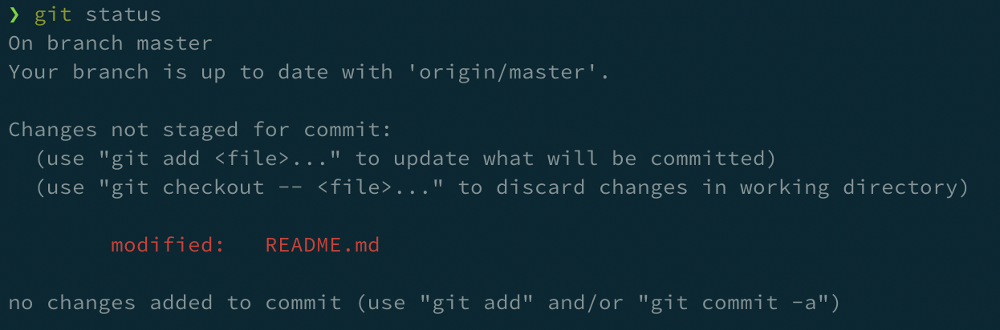
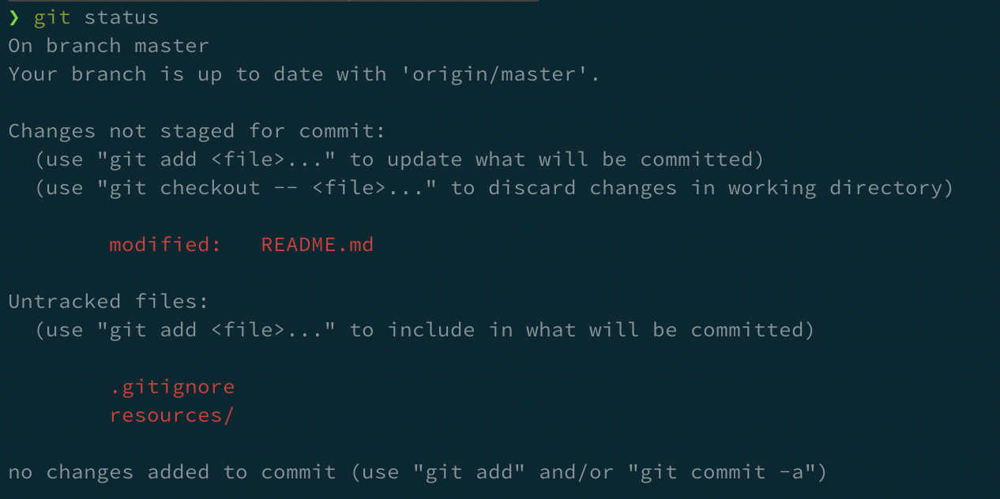
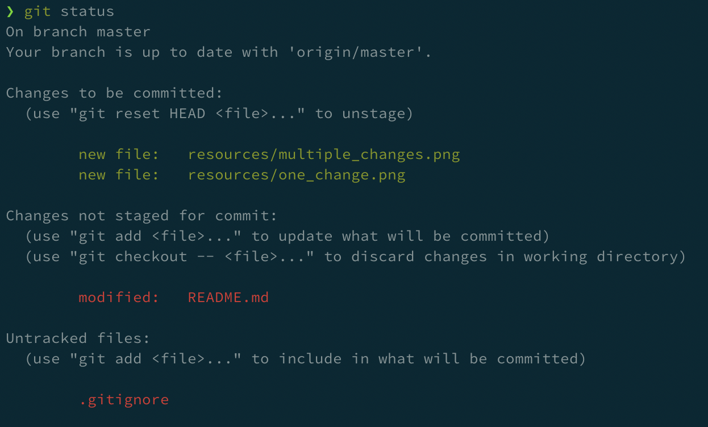

# Basic git workflow
## Cloning the repository
Git is a distributed version-control system for tracking changes in source code during software development. It is designed for coordinating work among programmers.

Changes to any code or artefacts must never be done through the UI of whatever git provider being used, as it harms good practices of software development using source control systems.

The changes to project artefacts must be done on the local machine and the first step is to get a clone of it. To clone a git repository, it is necessary to run the following command:

```sh
git clone <REPOSITORY_URL>
```
## Work on the code
The purpose of this document is to provide a basic view of the source control philosofy for software development being agnostic and valid for all projects.

### Create a new branch
Before modifying any artefact, the first step is to create a new branch (example branch names: feature/implement-python-container or fix/change-encryption-keys-address) to make the changes in.
```sh
git checkout -b <DESIRED_BRANCH_NAME>
```
### Change code/artefacts
After creating the branch, it is up to the user to make their changes. To check which files have been modified, run:
```sh
git status
```
The output will be sonething like in the screenshot below.



To view the modifications to a file tracked with git run:
```sh
git diff <NAME_OF_THE FILE>
```

## Add your desired changes to tracked artefacts

After doing all desired modifications, it is necessary to stage the files for commit. 

Running a `git status` again will show all modifications, similar to what is in the screenshot below.



To stage one of the files untracked or not staged for commit run (files that should be pushed to the remote repository):

```sh
git add <FILE_TO_STAGE>
```

After adding the files that are to be pushed to the remote server, the result of a `git status` will be something similar to the screenshot below.



It is also possible to add all files for staging:

```sh
git add .
```
## Commit your changes

After adding all the files to be pushed, it is necessary to commit them. A commit is the base unit for a change in code, a list of commits is what will show up in a pull request, to be discussed in the following sections. To do a commit, run the following, passing along a message (example message: "Fix address for encryption keys.")

```sh
git commit -m "<COMMIT_MESSAGE>"
```

## Push changes back to the repository
After commiting the changes, to push the changes to the remote repository, just run:

```sh
git push origin <DESIRED_BRANCH_NAME>
```

## Open a new pull request
After commiting (may be one or more pushes to the remote repository) the work that makes sense to do in the created branch, the correct procedure is to merge that branch into master. To do this, it is necessary to open a pull request. Pull requests allow the user to share the new/modified code with other project contributors and are usually done through the `git` provider UI.

Note that a branch where there is broken functionality or where tests are failing must not be submitted to be merged into master with a pull request.

### Choose reviewers

Good practices say that at least two reviewers are selected for a pull request. The chosen reviewers should have knowledge on the pushed changes and review the new/modified artefacts thoroughly.

### Merge the pull request
After the changes have been approved by the reviewers or the suggested modifications taken into account, the user that raised the pull request should be the one to close it.

After the code is merged to master, most `git` providers provide the possibility to close the source branch, which should be done so that there is no proliferation of stale branches.

## Cleanup local repository
After the code has been merged, it is good practice to cleanup the local development environment. After reading this document, the sequence of commands below should be self-explanatory.

```sh
git checkout master
git pull
git branch
```

The result of `git branch` returns a list of branches. It is necessary to choose one of the local branches to delete and run:

```sh
git branch -d <DESIRED_BRANCH_NAME>
```

As a safety mechanism, `git` will only sucessfully delete the local branch if all the changes pulled with `git pull` cover the modifications made in the branch `<DESIRED_BRANCH_NAME>`.